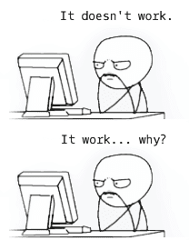
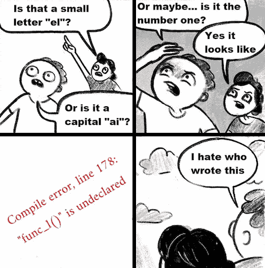

    <header>
        <h1>
             
            Hi 👋, I'm Fabio
        </h1>
        <h3>
            I like art, design and typography ...and of course <a href="https://jshint.com">❤️</a> <a href="https://httparchive.org/reports/state-of-javascript" target="_blank">Js</a>.
        </h3>
    </header>
    

        <a href="https://developer.mozilla.org/en-US/search?q="><!-- ?q=FabioVergani -->
            
        </a>
    

    <table>
       <tr>
          <td valign="top" width="33%" rowspan="2"> 
             
            

                

                    
                

                

                    
                

                

                    
                

            

      </td>
      <td valign="top" width="32%">
<pre>

// <a href="https://prettier.io/playground">prettier</a>-ignore

// <a href="https://prettier.io/docs/en/configuration.html">.prettierrc</a>
{
  "printWidth": 80,
  "tabWidth": 2,
  "useTabs": true,
  "semi": true,
  "singleQuote": true,
  "trailingComma": "none",
  "bracketSpacing": true,
  "arrowParens": "avoid",
  "proseWrap": "preserve",
  "overrides": [{
   "files": "*.css",
   "options": {
    "singleQuote": false,
    "useTabs": true,
    "tabWidth": 4
   }
  }]
}
</pre>
      </td>
      <td valign="top" width="34%">
<pre>

// edit <a href="https://try.terser.org">terser</a> <a href="https://terser.org/docs/api-reference#minify-options-structure">options</a>

{
    compress: {
        global_defs: {
            DEBUG: true
        }
    },
    mangle: false,
    output: {
        beautify: true,
        comments: true,
        braces: true
    },
    keep_classnames: true,
    keep_fnames: true
}
</pre>
<pre>
terser
    input.js
    -o output.js
    --config-file tc.js
</pre>
          </td>
      </tr>
		<tr>
			<td colspan="2">
<pre>
<a href="https://formulae.brew.sh/cask/chromium">brew</a> install <a href="https://www.chromium.org/chromium-projects/)">chromium</a> --no-quarantine
 
<a href="https://eslint.org/demo">eslint</a>-disable
<a href="https://eslint.org/docs/user-guide/configuring/language-options">global</a> globalThis
</pre>
            </td>
		</tr>
    </table>
    

        <b><a href="https://developer.mozilla.org/en-US/docs/Web/API/ChildNode/after">#javascript</a></b>&ensp;
        <b>#learningisfun</b>&ensp;
        <b>#frontend</b>&ensp;
        <b>#senior</b>
    

    

        
    
 
    <pre><a href="https://developer.chrome.com/blog/quickly-monitor-events-from-the-console-panel-2/">monitorEvents</a>(object [, events])</pre>

 

<!--

-->
