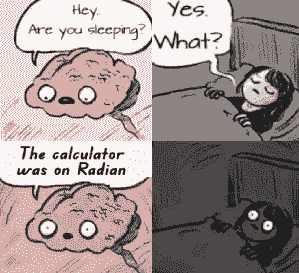

    <header>
        <h1>
             
            Hi 👋, I'm Fabio
        </h1>
        <h3>
            I like art, design, typography, <a href="https://httparchive.org/reports/state-of-javascript" target="_blank">Javascript</a>, ...and <a href="https://html-preview.github.io/?url=https://github.com/FabioVergani/ai-prompt/blob/main/conversational.htm" target="_blank">AI</a>.
        </h3>
    </header>
    

        <a href="https://developer.mozilla.org/en-US/search?q="><!-- ?q=FabioVergani -->
            
        </a>
    

    <table>
		<tr>
			<td colspan="3">
				<a href="https://raw.githubusercontent.com/FabioVergani/FabioVergani/e6a40f4d822616189fd41f94070dc35c79e0fb6b/hardTruths.md">Code never lies;</a>
				comments sometimes do.
			</td>
		</tr> 
		<tr>
			<td colspan="3" title="Learn the fundamentals, build things, break things, fix it. 𝗧𝗵𝗲𝗿𝗲 𝗮𝗿𝗲 𝗻𝗼 𝘀𝗵𝗼𝗿𝘁𝗰𝘂𝘁𝘀">
				AI doesn’t give you a shortcut: It gives you a detour — unless you know how to guide it.
			</td>
		</tr>
		<tr>
			<td colspan="3">
				Writing code is thinking: don’t outsource that.
			</td>
		</tr>
		<tr>
			<td colspan="3">
				Code dependencies can be more tangled than they seem, and this complexity poses serious security risk.
			</td>
		</tr>
		<tr>
			<td colspan="3">
				Micro-optimizations <i>without measurement</i> and correctness are worse than no optimization at all.
			</td>
		</tr>
        <tr>
            <td valign="top" width="33%" rowspan="3">
                 
                

                    

                        
                    

                    

                        
                    

                    

                        
                    

		    

        		<b>#learningisfun</b>&ensp;
        		<b><mark><a href="./frontend.md">#frontend</a></mark></b>  	    
		    

		    
                

            </td>
            <td valign="top" width="32%">
		    <pre><code>// <a href="https://prettier.io/docs/en/configuration.html">.prettierrc</a>

{
  "printWidth": 80,
  "tabWidth": 2,
  "useTabs": true,
  "semi": true,
  "singleQuote": true,
  "trailingComma": "none",
  "bracketSpacing": true,
  "arrowParens": "avoid",
  "proseWrap": "preserve",
  "overrides": [{
    "files": "*.css",
    "options": {
      "singleQuote": false,
      "useTabs": true,
      "tabWidth": 4
    }
  }]
}</code></pre>
<pre>
// <a href="https://prettier.io/playground">prettier</a>-ignore
</pre>
            </td>
            <td valign="top" width="34%">
<pre><code>// edit <a href="https://try.terser.org">terser</a> <a href="https://terser.org/docs/api-reference#minify-options-structure">options</a>

{
    compress: {
      booleans: false,
      global_defs: {
        DEBUG: true
      }
    },
    mangle: false,
    output: {
      beautify: true,
      comments: true,
      braces: true
    },
    keep_classnames: true,
    keep_fnames: true
}</code></pre>
<pre>
terser
    input.js
    -o output.js
    --config-file <a href="https://terser.org/docs/api-reference/#minify-options-structure">tc.json</a>
</pre>
            </td>
        </tr>
	<tr>
		<td>
<pre><code>// <a href="https://jsdoc.app">jsdoc</a>
 
/[ \t]*\/\*\*\s*\n([^*]*(\*[^/])?)*\*\//g
</code></pre>
		</td>
		<td rowspan="2">
			
<pre title="Il vero problema è che testiamo sempre nelle condizioni sbagliate.&#010;&#010;Facciamo prove di carico quando tutto è perfetto, stabile, pulito&#010;ed i pianeti sono allineati... ma nella realtà, le cose vanno male&#010;sempre nel modo più stupido ed imprevedibile possibile.&#010;&#010;C’è una verità che tutti conoscono ma che pochi hanno il coraggio di urlare:&#010;i sistemi critici vengono testati per fallire in modo educato,&#010;non in modo realistico.">
❌ Every functions needs a unit test.
❌ More tests mean fewer bugs.
❌ 100% coverage guarantee quality. 
✅ Selective unit testing.
✅ Integration tests.
✅ Robust production monitoring.
</pre>	
			
		</td>
	</tr>
        <tr>
            <td>
				
<pre>
<a href="https://formulae.brew.sh/cask/chromium">brew</a> install <a href="https://www.chromium.org/chromium-projects/)">chromium</a> --no-quarantine
 
<a href="https://eslint.org/demo">eslint</a>-disable
<a href="https://eslint.org/docs/user-guide/configuring/language-options">global</a> globalThis
 
<a href="https://developer.chrome.com/blog/quickly-monitor-events-from-the-console-panel-2/">monitorEvents</a>(object [, events])
</pre>
				
            </td>
        </tr>
		<tr>
			<td colspan="3">
				If you think technology can solve your security problems, 
				then you don't understand the problems and you don't understand the technology. 
				
					Bruce Schneier
				
			</td>
		</tr>
		<tr>
			<td colspan="3">
				It's hardware that makes a machine fast. 
				It's software that makes a fast machine slow. 
				
					Craig Bruce
				
			</td>
		</tr>
		<tr>
			<td colspan="3">
				Clean code always looks like it was written by someone who cares. 
				
					Robert C. Martin
				
			</td>
		</tr>
		<tr>
			<td colspan="3">
				Bokanovsky's Process is one of the major instruments of social stability! 
				
					Aldous L. Huxley, <i>Brave New World</i> (1932)
				
			</td>
		</tr>
		<tr>
			<td colspan="3">
				It is necessary to choose between being mediocre at a few things, 
				good at a few, or truly excellent at one or two. 
				It is necessary, in any case, to choose, or life will choose for us anyway. 
				
					Yukio Mishima
				
			</td>
		</tr>
		<tr>
			<td colspan="3">
				A human being should be able to change a diaper, 
				plan an invasion, butcher a hog, conn a ship, 
				design a building, write a sonnet, 
				balance accounts, 
				build a wall, 
				set a bone, 
				comfort the dying, 
				take orders, give orders, 
				cooperate with others, act alone, 
				solve equations, analyze a new problem, 
				pitch manure, program a computer, cook a tasty meal, 
				fight efficiently, die gallantly. 
				Specialization is for insects. 
				
					Robert A. Heinlein, <i>Starship Troopers</i> (1959)
				
			</td>
		</tr>
    </table>

つづく

<!--

    
-->
